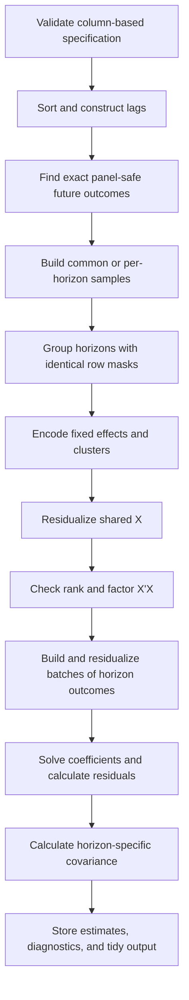

# fastLP Estimation Pipeline and Library Comparison

## Purpose and scope

This document describes what the current `fastLP` implementation does at each
stage of estimation and compares that stage with the `fixest`, `reghdfe`, and
`statsmodels` designs discussed in
[`deep-research-report.md`](deep-research-report.md). It is an implementation
companion to that report, not a benchmark claim. The comparisons describe
architecture and supported behavior; actual speed depends on the data,
specification, library version, build, and hardware.

`fastLP` 0.1 is deliberately narrower than the comparison libraries. It is a
Python estimator for linear local projections on balanced or unbalanced panel
data. Its main optimization is to recognize when horizons share a right-hand
side design, residualize and factor that design once, and solve the horizon
regressions as a batched multiple-outcome problem.

The implemented model is

\[
y_{i,t+h}=X_{i,t}\beta_h+D_{i,t}\alpha_h+u_{i,t+h},
\qquad h=0,\ldots,H,
\]

where `X` contains one or more shocks, controls, and optionally generated
lags, while `D` contains zero or more categorical fixed effects. With fixed
effects, the intercept is absorbed; without fixed effects, `fastLP` adds an
intercept.

## End-to-end pipeline

The unit of reuse is a **sample-mask group**. Under `sample="common"`, every
horizon has the same mask and there is one group. Under
`sample="per_horizon"`, horizons share a prepared design only when their
retained-row masks are identical.

## Step 1: validate the specification and input data

`LocalProjection.fit` accepts a pandas `DataFrame` and a column-name API. It
normalizes shocks, controls, fixed effects, cluster terms, and lag requests;
checks required columns; converts model variables to `float64`; rejects
non-finite values; and requires `(unit, time)` to identify rows uniquely.
Version 0.1 requires complete data in all supplied model columns. Cluster
terms may be individual columns or explicit interactions, with at most four
requested dimensions.

| Library | Comparison at this stage |
|---|---|
| `fastLP` | Small, typed, column-name API specialized for panel LPs; no formula parser. Performs panel-key and LP-specific validation itself. |
| `fixest` | Much richer R formula interface, including fixed effects, IV syntax, varying slopes, multiple outcomes, and stepwise specifications. Its front end serves many estimators, not only LPs. |
| `reghdfe` | Stata command syntax with mature factor-variable and absorb semantics. It is an HDFE regression command rather than an LP planner. |
| `statsmodels` | Broad array and formula APIs across many model classes. Panel-safe LP construction remains the caller's responsibility. |

The trade-off is intentional: `fastLP` gives up formula-language breadth to
make the reusable, horizon-invariant design explicit.

## Step 2: order the panel and generate anchor-date lags

`fastLP` checks whether rows are already ordered by `(unit, time)` and applies
a stable sort if needed. It generates requested outcome, shock, and control
lags with within-unit `groupby(...).shift(lag)`. A scalar lag count includes
all lags from one through that count; an explicit sequence permits a sparse
lag grid; mappings allow variable-specific shock or control lags.

Rows lacking a requested lag cannot be regression anchors, but remain in the
frame so that their outcomes can still serve as future dependent variables.
Lagging is based on preceding sorted observations, whereas outcome leads are
matched by exact calendar time in the next step. This distinction is part of
the current API contract.

| Library | Comparison at this stage |
|---|---|
| `fastLP` | Builds reusable anchor-date regressors once and records whether input sorting was needed. |
| `fixest` | Provides panel lead/lag helpers and supports repeated/multiple-outcome workflows, but a custom LP still needs an explicit horizon plan. |
| `reghdfe` | Uses Stata time-series operators in a horizon loop; each command invocation ordinarily reconstructs the regression context. `locproj` is a separate Stata command. |
| `statsmodels` | Usually relies on pandas, Patsy, or user code for sorting and lag construction. |

## Step 3: align future outcomes without crossing panels

For a balanced panel with unit-spaced numeric time, `fastLP` constructs leads
with arithmetic array positions. Otherwise it looks up the exact key
`(unit, time + h)` for every horizon. A missing calendar period is therefore
missing rather than being mistaken for the next observation. For nonnumeric
time labels, it only uses row offsets when all units share the same ordered
time index; otherwise it rejects the ambiguous unbalanced-panel input.

The default `response="level"` uses `y[t+h]`. With
`response="cumulative"`, the dependent variable is
`y[t] + ... + y[t+h]`; balanced panels construct it with within-unit prefix
sums. This is a cumulative response, not an integral multiplier, and its
standard error comes from the cumulative regression itself.

This is a core difference from using a generic regression engine in a loop:
`fixest`, `reghdfe`, and `statsmodels` can estimate each resulting regression,
but the orchestration layer must ensure that leads do not cross units or skip
calendar gaps incorrectly. `fastLP` makes that check part of the estimator.

## Step 4: choose the horizon sample and cache groups

The future-position matrix and lag-validity mask determine the usable anchors.

- `sample="common"` intersects validity over all horizons. Every coefficient
  uses the same anchor rows, and the design, FE topology, Gram matrix, and
  factorization are shared once.
- `sample="per_horizon"` retains all valid anchors at each horizon. `fastLP`
  hashes each row mask and reuses a design only among horizons with the same
  mask.

When fixed effects are present, `singleton_policy="drop"` recursively removes
rows that are the sole observation in any FE level. Since a removal in one FE
dimension can create a singleton in another, pruning continues to a stable
sample. Common masks are pruned once and reused; per-horizon masks are pruned
independently and then regrouped by their final retained rows. The result
reports dropped counts and pruning rounds by horizon. Users can select
`singleton_policy="keep"` for an explicit no-pruning comparison.

The result exposes `n_obs_by_horizon_`, `sample_index_by_horizon_`, and
`cache_group_by_horizon_`, so sample composition and reuse are auditable.

| Library | Comparison at this stage |
|---|---|
| `fastLP` | Sample policy and mask-grouped caching are first-class LP features. |
| `fixest` | Multiple outcomes and reusable estimation environments can amortize work, but horizon-specific missingness still has to be handled correctly by the calling LP workflow. |
| `reghdfe` | A conventional horizon loop naturally uses each horizon's available sample and repeats absorption unless the user builds additional machinery. |
| `statsmodels` | A repeated-regression workflow likewise leaves common-sample construction and cache validity to user code. |

Common sampling improves cross-horizon comparability and maximizes reuse, but
can discard observations usable at short horizons. Per-horizon sampling uses
more data but can change sample composition and reduce reuse.

## Step 5: construct the design and encode categorical structure

The design contains shocks, controls, and generated lags. `fastLP` prepends a
constant only when there are no fixed effects. For every distinct sample mask,
categorical fixed effects are factorized into contiguous `int64` codes with a
stored group count. Cluster variables and interactions are encoded separately.
No dummy-variable matrix is formed.

| Library | Comparison at this stage |
|---|---|
| `fastLP` | Compact integer FE topology is prepared per mask group and reused for `X` and batches of `Y`. |
| `fixest` | Also uses compact FE identifiers and richer precomputed group systems; additionally supports weights and varying slopes. |
| `reghdfe` | Uses implicit FE operators and exposes extensive HDFE controls, including transforms, accelerators, Krylov solvers, and preconditioners. |
| `statsmodels` | Core OLS is a dense design-matrix path. Large categorical expansions can become expensive before fitting unless external absorption is used. |

Unlike `fixest` and `reghdfe`, current `fastLP` does not calculate absorbed-FE
degrees of freedom, recover FE coefficients, support varying slopes, or accept
weights.

## Step 6: residualize fixed effects

The residualization policy specializes before invoking an iterative solver:

- an arbitrary one-way FE uses an exact grouped within transformation;
- balanced unit, time, or unit-and-time FEs use exact dense-panel formulas;
- other multiway FE structures use alternating group projections.

For the general path, both backends use alternating group projections. The
Rust backend applies a symmetric forward-and-reverse sweep over the FE
dimensions, while the NumPy fallback applies a cyclic forward sweep. Both
support guarded Irons--Tuck
acceleration by default, vector Aitken acceleration as an alternative, and an
unaccelerated reference mode. An extrapolated iterate is accepted only when it
is finite and reduces the largest remaining absolute FE-group mean. Both
backends stop when the maximum absolute update is below `demean_tol` and raise
if `max_iter` is exhausted.

The same prepared residualizer transforms the shared `X` and every associated
batch of horizon outcomes. Diagnostics report backend, method, iteration
counts, and accepted acceleration steps.

| Library | Comparison at this stage |
|---|---|
| `fastLP` | Exact one-way and balanced unit/time transforms; otherwise symmetric alternating projections in Rust or cyclic alternating projections in NumPy, with guarded Irons--Tuck by default, optional Aitken, and an unaccelerated reference. |
| `fixest` | Multithreaded C++ demeaning with Irons--Tuck acceleration, weights, and varying slopes. More mature and feature-rich. |
| `reghdfe` | Most configurable absorber: MAP with several projection transforms and accelerators, plus LSMR/LSQR and preconditioning. |
| `statsmodels` | No specialized HDFE absorber in the core linear-model path described by the research report. |

`fastLP` still exposes a smaller solver policy than `reghdfe`. It has no Krylov
solver, graph preconditioner, or FE reordering policy, and its convergence
check is absolute rather than scale-relative.

## Step 7: check rank and factor the shared design

For each sample-mask group, `fastLP` computes
column norms and scales the residualized design before computing and
symmetrizing its small Gram matrix. Numerical rank and condition estimates are
obtained from the eigenvalues of this `K`-by-`K` matrix; no decomposition of
the full `N`-by-`K` design is used. After requiring positive residual degrees
of freedom, `fastLP` performs an unpivoted Cholesky factorization. Coefficients
are obtained with triangular solves and coefficients and covariance matrices
are mapped back to the original feature units. A Cholesky-based `bread`,
mathematically `(X'X)^{-1}`, is calculated once for covariance estimation.

Detected numerical rank loss, negligible within variation, and Cholesky
failure produce contextual errors. Solver diagnostics report rank, the rank
tolerance, original column norms, and condition estimates for the scaled
design and Gram matrix. There is currently no column-dropping policy, pivoted
QR, or SVD fallback.

| Library | Comparison at this stage |
|---|---|
| `fastLP` | Column-scaled cross-products plus unpivoted Cholesky after a small-matrix rank and condition check; maximizes reuse for modest `K`, but has no fallback solver. |
| `fixest` | Cross-products plus a custom rank-revealing Cholesky that can identify and exclude collinear columns. Architecturally closest to `fastLP` at this stage. |
| `reghdfe` | Runs the final regression after partialling out and exposes an optional faster normal-equation path; also offers iterative paths for absorption. |
| `statsmodels` | Moore--Penrose pseudoinverse by default or QR on request, with numerical rank retained. Generally more forgiving of rank deficiency, at additional dense-linear-algebra cost. |

Because forming `X'X` squares the condition number, the lack of a stable
QR/SVD fallback is one of the most important current differences between
`fastLP` and a production general-purpose regression engine.

## Step 8: transform horizon outcomes and solve in batches

For each cache group, future outcomes are assembled into matrices in batches
of at most 32 horizons. A user-supplied `memory_budget` can reduce this batch
size based on the observation count. The prepared FE operator residualizes the
outcome matrix, and the cached Cholesky factor solves

\[
\widehat B=(\widetilde X'\widetilde X)^{-1}
             \widetilde X'\widetilde Y.
\]

Residuals are then computed as `Y_tilde - X_tilde @ B`. The horizon batch
bounds temporary memory and exposes parallel work to the Rust residualizer
without duplicating the design. With `retain_residuals=False`, residuals are
used for inference and released rather than retained in the fitted object.

| Library | Comparison at this stage |
|---|---|
| `fastLP` | LP-native multiple-right-hand-side execution with explicit mask-aware cache reuse. |
| `fixest` | Its multiple-dependent-variable and reusable-environment design follows a similar amortization philosophy, with a much broader estimator surface. |
| `reghdfe` | Typical LP usage loops over horizons; its strength is each HDFE regression, not cross-horizon planning. |
| `statsmodels` | Typical LP usage also loops over model fits; generic APIs favor flexibility over shared horizon state. |

This cross-horizon execution plan is `fastLP`'s principal specialization and
the main reason it should not be viewed as merely another OLS wrapper.

## Step 9: compute covariance and inference

Point estimates are independent of covariance choice. `fastLP` supports:

- homoskedastic covariance;
- HC0, HC1, HC2, and HC3;
- one- through four-way Cameron--Gelbach--Miller clustering with CR0 or CR1
  corrections and explicit interaction cluster terms;
- within-unit Newey--West HAC; and
- Driscoll--Kraay covariance.

Cluster covariance applies inclusion--exclusion over every nonempty
intersection of requested cluster dimensions. Cluster scores are accumulated
in bounded batches; an optional Rust kernel accelerates each intersection.
HAC uses exact calendar-lag pairs, supports Bartlett, Parzen, and quadratic
spectral kernels, and records the effective horizon-specific bandwidth.
Driscoll--Kraay first aggregates scores by calendar time.

Each requested cluster term with fewer than 50 groups emits a
`FewClustersWarning` by default. The threshold is configurable or can be
disabled. It is a diagnostic threshold, not a validity cutoff, and the warning
states that CR1 does not eliminate the few-cluster problem.

| Library | Comparison at this stage |
|---|---|
| `fastLP` | Broad covariance menu for its narrow LP model; covariance is batched over horizons and diagnostics are retained per horizon. |
| `fixest` | Broad integrated covariance families and configurable small-sample corrections, plus mature reporting. |
| `reghdfe` | Built-in multiway clustering and close integration with Stata econometric workflows; IV inference is handled through related packages. |
| `statsmodels` | Broad robust-covariance APIs including HC, HAC, panel-HAC, and clustering, but not organized around one shared LP plan. |

The reported confidence intervals use normal critical values. Current
`fastLP` does not provide cluster-based degrees-of-freedom critical values,
CR2/CR3, wild bootstrap, joint cross-horizon covariance, or simultaneous
confidence bands.

## Step 10: expose results and diagnostics

The fitted object stores coefficient, standard-error, covariance, and
confidence-interval arrays, plus residual arrays unless retention was disabled.
It also reports horizon samples and indices, cache-group assignments,
covariance configuration and diagnostics, demeaning iterations, accepted
accelerations and methods, backend selection, batch size, lead path, and
whether the input was already sorted. `to_frame()` returns one tidy row per
horizon and coefficient and labels the response as level or cumulative.

| Library | Comparison at this stage |
|---|---|
| `fastLP` | Compact scikit-learn-style fitted object and LP-shaped tidy output; unusually explicit cache and horizon-sample diagnostics. |
| `fixest` | Rich econometric result objects, tables, plotting, FE extraction, model combinations, and specification reporting. |
| `reghdfe` | Mature Stata estimation results and HDFE diagnostics that compose with the Stata ecosystem. |
| `statsmodels` | Broad model/result classes with extensive diagnostics, hypothesis tests, prediction, and summary machinery. |

`fastLP` results are sufficient for pointwise LP paths, but the general-purpose
libraries provide substantially richer post-estimation and hypothesis-testing
interfaces.

## Capability summary

| Feature or design choice | `fastLP` 0.1 | `fixest` | `reghdfe` | `statsmodels` |
|---|---|---|---|---|
| **Primary scope** | Panel local projections | High-performance econometric estimation | High-dimensional FE regression in Stata | General statistical modeling in Python |
| Primary interface | Typed column-name API | Rich R formulas | Stata command and factor-variable syntax | Array and formula APIs |
| Core estimator families | Linear LP-OLS | OLS, IV, GLM, ML, DiD and related models | Linear HDFE OLS; related commands extend scope | OLS, WLS, GLS, GLM, discrete, time-series and many others |
| Data front end | pandas `DataFrame` | R data frames and related objects | Stata dataset | NumPy/pandas arrays and Patsy formulas |
| Complete-data policy | Requires complete supplied model columns | Model-specific missing-value filtering | Stata estimation-sample rules | Model/formula missing-data policy |
| Formula language | No | Extensive | Extensive Stata syntax | Patsy formulas plus arrays |
| Multiple outcomes/specifications | Horizons are native multiple outcomes | Native multiple LHS and stepwise tools | Usually repeated commands | Usually user orchestration |
| Weighted estimation | No | Yes; several weight workflows | Yes | OLS/WLS/GLS architecture |
| IV estimation | No | Integrated in `feols` | Via `ivreghdfe` | `IV2SLS`/GMM modules outside core OLS |
| Nonlinear models | No | GLM and ML estimators | Not the core command | Broad model families |
| **Local-projection design** |  |  |  |  |
| LP-aware horizon planner | Built in | User workflow | User loop or separate `locproj` command | User workflow |
| Panel-safe lead construction | Built in; exact calendar matching | Available building blocks; workflow-owned | Stata time-series operators; workflow-owned | User/pandas orchestration |
| Automatic lag construction | Outcome, shock, and control lags | Formula/panel helpers | Stata time-series operators | User/formula construction |
| Level responses | Yes | User LP workflow | User LP workflow | User LP workflow |
| Cumulative responses | Built in with regression-based inference | User LP workflow | LP tooling/user workflow | User LP workflow |
| Common horizon sample | Built in and default | User-controlled workflow | User-controlled loop | User-controlled workflow |
| Per-horizon samples | Built in | Natural in separate fits | Natural in separate fits | Natural in separate fits |
| Horizon sample audit trail | Counts, original indices, and cache groups | Estimation samples per fitted model | Stata estimation sample per fit | Row labels/model data per fit |
| Reuse across identical horizon designs | Explicit mask-grouped cache | Strong repeated-specification machinery | Not the primary abstraction | Not the primary abstraction |
| Multiple-right-hand-side solve | Native batched horizon path | Multiple-outcome machinery amortizes work | Normally separate fits | User-managed array workflow |
| Joint cross-horizon covariance | No | Requires LP-specific workflow | Requires LP-specific tooling | Requires LP-specific workflow |
| Simultaneous LP bands | No | Requires LP-specific workflow | Available only through LP-specific tooling | Requires LP-specific workflow |
| **Fixed effects and absorption** |  |  |  |  |
| One-way FE transform | Exact grouped within transform | Built-in optimized absorption | Built-in optimized absorption | Usually explicit dummies in core OLS |
| Balanced unit/time transform | Exact one- or two-way formula | General optimized absorber | General optimized absorber | User preprocessing or dummies |
| Arbitrary multiway HDFE | Yes | Yes | Yes | Not in the cited core OLS path |
| Compact FE representation | Contiguous `int64` codes | Compact identifiers and group systems | Implicit FE operators in Mata | Dense design in core formula/OLS path |
| Default iterative transform | Symmetric alternating projections in Rust | Package-specific projection algorithm | Symmetric Kaczmarz MAP | Not applicable in core OLS |
| Acceleration | Guarded Irons--Tuck default; Aitken optional | Irons--Tuck with additional tuning strategies | Conjugate gradient default; other accelerators | Not applicable in core OLS |
| Alternative absorber solvers | Unaccelerated alternating-projection reference | Tunable projection/acceleration policy | MAP, LSMR, and LSQR | External preprocessing required for HDFE |
| Preconditioning | No | Internal specialized group systems | None, diagonal, or block diagonal by solver | General SciPy tools, not core HDFE integration |
| FE reordering | No | Frequency-based reordering available | Solver-specific internal handling | Not applicable |
| Singleton removal | Recursive by default; explicit `keep` option | Recursive policies | Iterative removal | No HDFE-specific policy in core OLS |
| Varying slopes | No | Yes | Yes | Explicit design construction |
| FE coefficient recovery | No | Yes, subject to normalization | Yes, subject to identification caveats | Explicit dummy coefficients if modeled |
| Absorbed-FE degrees of freedom | Not yet reported | Built in | Built in with documented approximations | Rank of explicit design |
| Convergence failure | Raises | Reported/controlled by options | Reported/controlled by options | Not applicable to direct core OLS solve |
| Absorber diagnostics | Backend, method, iterations, accepted accelerations | Iteration and algorithm controls | Detailed solver and convergence controls | Not applicable to core OLS |
| **Numerical linear algebra** |  |  |  |  |
| Final OLS strategy | Shared `X'X` plus Cholesky | Cross-products plus rank-aware Cholesky | Regression after absorption; optional normal equations | Pseudoinverse default; QR optional |
| Coefficient-system operation | Cholesky triangular solves; no direct inverse | Cholesky-factor inverse/cross-product machinery | Solver-dependent | Pseudoinverse or QR solve |
| Rank detection | Scaled `K`-by-`K` Gram eigenvalue check before Cholesky | Rank-revealing exclusion | Mature collinearity handling | Numerical rank retained |
| Rank-deficient behavior | Raises | Drops/reports collinear columns | Drops/reports omitted variables | Pseudoinverse accommodates rank loss |
| Ill-conditioning fallback | No QR/SVD fallback | Tolerance-controlled Cholesky policy | Stable/default and faster-riskier paths | Pseudoinverse or QR |
| Column scaling policy | Internal column-norm scaling; results mapped back to original units | Internal estimator-specific handling | Solver/preconditioner options | User/model-dependent |
| **Covariance and inference** |  |  |  |  |
| Homoskedastic covariance | Yes | Yes | Yes | Yes |
| HC0--HC3 | Yes | Broad heteroskedastic options | Robust options through Stata workflow | Yes |
| One-way clustering | CR0 or CR1 | Yes | Yes | Yes |
| Multiway clustering | One through four requested terms | Yes | Yes | More limited utilities/API-dependent |
| Cluster interactions | Explicit tuple terms | Formula-based interactions | Stata interaction syntax | User-created group codes |
| Multiway computation | Inclusion--exclusion; native score kernels | Optimized native implementation | Optimized Mata/Stata implementation | Utility/API-dependent |
| Few-cluster diagnostics | Configurable warning, default below 50 | Small-sample controls and user diagnostics | Reports cluster counts; inference options | User inspects groups/results |
| HAC/Newey--West | Within-unit, exact calendar lags | Supported covariance families | Ecosystem/specification-dependent | HAC and panel-HAC APIs |
| Driscoll--Kraay | Yes | Supported covariance families | Ecosystem/specification-dependent | Panel covariance APIs |
| Kernel choices | Bartlett, Parzen, quadratic spectral | Covariance-function dependent | Command-dependent | Covariance-function dependent |
| Small-sample cluster correction | CR0 or CR1 | Configurable conventions | Built-in conventions | Covariance-option dependent |
| Critical values | Normal | Configurable/model-dependent inference | Stata inference conventions | Normal or Student-*t*, model-dependent |
| CR2/CR3 | No | Package/covariance support dependent | Ecosystem-dependent | Limited/model-dependent |
| Wild cluster bootstrap | No | External/integrated ecosystem workflows | Stata ecosystem tools | External implementation |
| **Execution and memory design** |  |  |  |  |
| Native implementation | Python orchestration; Rust FE/cluster kernels | R front end; multithreaded C++ | Stata front end; Mata core | Python front end; NumPy/SciPy compiled kernels |
| Parallelism | Rayon across columns; BLAS for dense products | OpenMP with user thread control | Mata plus optional multiprocess absorption | BLAS/LAPACK backend threading |
| Balanced-panel fast path | Arithmetic leads, prefix sums, exact FE transform | General optimized estimator | General optimized estimator | User-managed |
| Horizon batching | Built in, maximum 32 by default | Multiple-estimation internals | Pool-size controls apply to absorption | User-managed |
| Memory-budget control | Adaptive outcome batch size | `lean`, `mem.clean`, environment reuse | `poolsize`, `compact`, `nosample` | User-managed arrays/chunking |
| Optional residual retention | Yes | Lean/result controls | Result/sample controls | Result-class dependent |
| Native clustered-score aggregation | Yes | Yes | Yes | Through NumPy/statistical utilities |
| Thread-policy tooling | Benchmark harness coordinates Rayon/BLAS variables | User-selectable thread fraction | Process/core controls | Backend environment controls |
| **Results and extensibility** |  |  |  |  |
| Result orientation | LP coefficient paths | Econometric model results | Stata estimation results | General model/result classes |
| Tidy coefficient output | Built in | Rich table/tidy ecosystem | Stata table ecosystem | pandas-compatible summaries |
| Confidence intervals | Pointwise, normal critical values | Rich inference methods | Rich Stata inference methods | Model-dependent methods |
| Prediction | No | Yes | Stata postestimation | Yes where defined |
| Hypothesis testing | No dedicated API | Extensive | Extensive Stata tests | Extensive |
| Plotting | Built-in IRF axes with confidence band and export through Matplotlib | Coefficient and interaction plotting | Stata graph ecosystem | Model/user plotting ecosystem |
| Cache diagnostics | Sample groups, batch size, backend, FE iterations | Reusable environments/internal diagnostics | Solver diagnostics | Not generally cross-model |

The entries for the comparison libraries summarize the architecture described
in the research report; they are not intended as exhaustive API inventories.
“User workflow” means that the library can estimate the component regressions,
but panel alignment, horizon samples, caching, or cross-horizon inference must
be supplied by orchestration outside the core estimator.

## Where fastLP is strongest

`fastLP` is most differentiated when many local-projection horizons share a
moderate-width anchor-date design:

1. lead construction is panel-safe and exact;
2. common versus horizon-specific sampling is explicit;
3. identical horizon samples are detected rather than assumed;
4. FE topology, residualized `X`, the Gram matrix, and its factorization are
   reused at the largest mathematically valid scope;
5. outcomes and covariance work are batched to control memory; and
6. diagnostics reveal which reuse path actually occurred.

In contrast, the other three libraries are stronger as general regression
engines. `fixest` offers the most integrated high-throughput econometric
workflow, `reghdfe` offers the most configurable HDFE solver, and
`statsmodels` offers the broadest Python statistical-modeling framework.

## Highest-priority gaps

Relative to the production blueprint in the research report, the current
implementation should next prioritize:

1. a pivoted QR or SVD fallback for designs rejected by the scaled Cholesky path;
2. absorbed-FE degrees-of-freedom reporting and FE coefficient recovery;
3. scale-aware demeaning tolerances and final residual orthogonality checks;
4. weights, with explicitly documented weight semantics;
5. IV local projections and first-stage/weak-identification diagnostics;
6. finite-sample cluster inference beyond CR1 and normal critical values; and
7. cross-horizon covariance or bootstrap support for simultaneous bands.

These additions would preserve `fastLP`'s LP-specific execution advantage
while closing the largest reliability and feature gaps identified in
[`deep-research-report.md`](deep-research-report.md).
