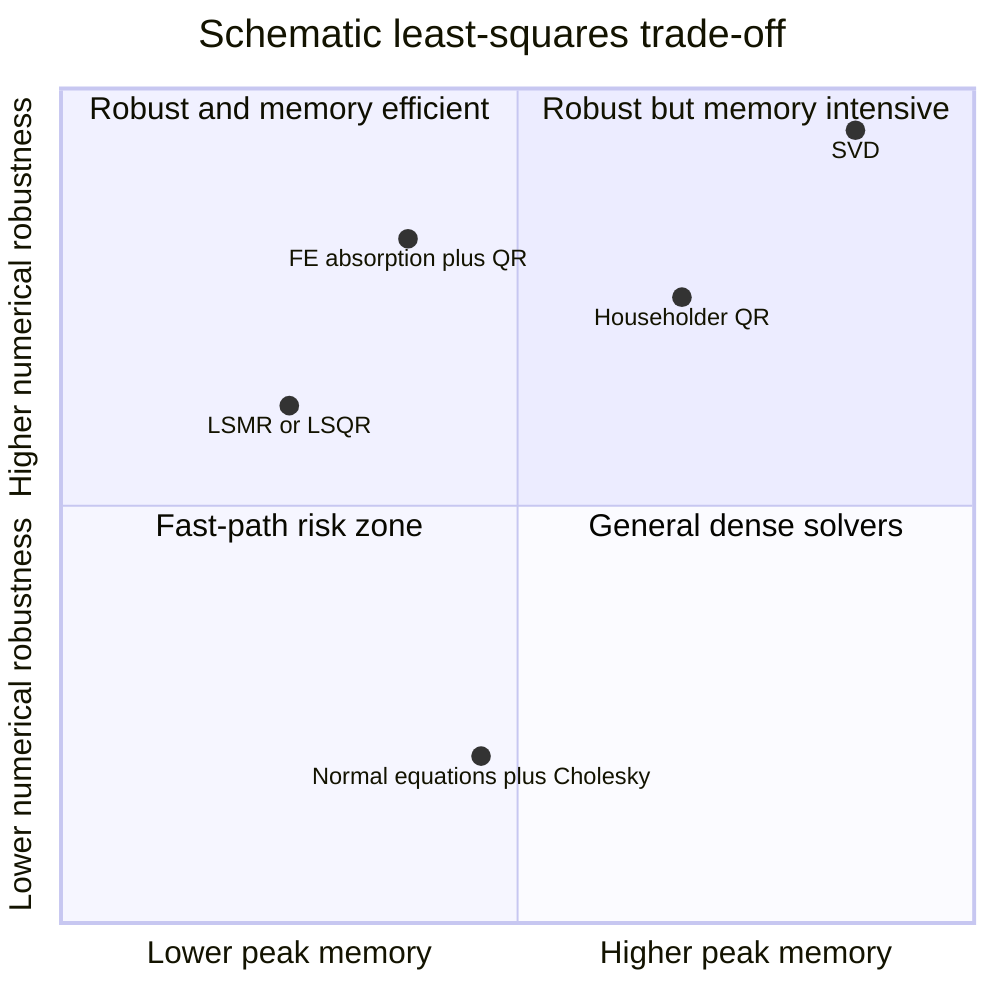
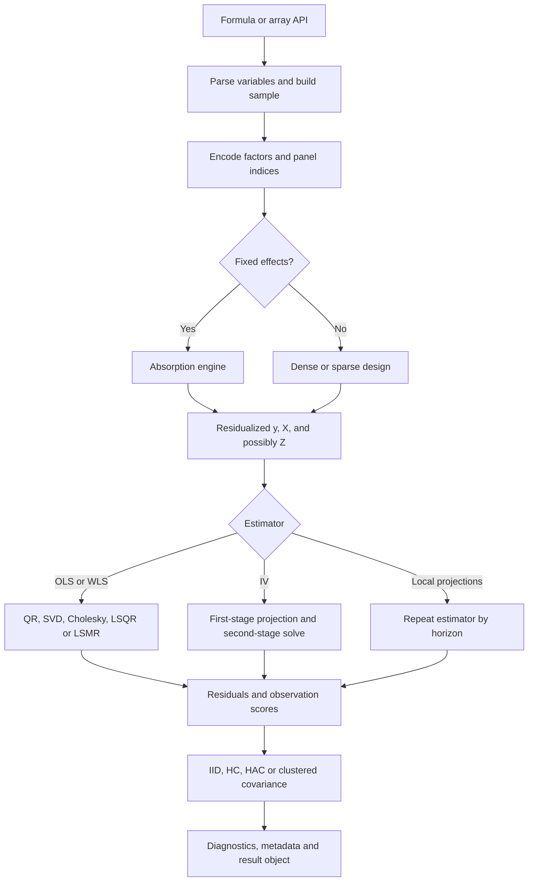
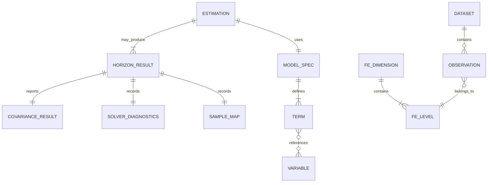

# Regression Estimation Engines: Statistical Foundations, Algorithms, and Modern Library Design

## Executive summary

Regression software is best understood as a pipeline rather than a single formula. A production estimator must construct and validate a design matrix, transform the problem to remove nuisance parameters or encode weights, solve a potentially ill-conditioned least-squares or instrumental-variables system, calculate residuals and scores, assemble an appropriate covariance estimator, and report diagnostics that disclose rank loss, convergence failure, weak identification, or unreliable asymptotics.

**Part I** of this paper explains the statistical layer. Ordinary least squares minimizes squared residuals. High-dimensional fixed-effects estimation applies the Frisch–Waugh–Lovell theorem to remove large collections of dummy variables without explicitly creating them. Local projections estimate a separate regression for each response horizon. Instrumental-variables estimators replace endogenous variation with variation predicted by valid instruments. Robust and clustered covariance estimators change inference, not the coefficient estimates, by replacing the classical covariance “meat” with empirical score cross-products.

**Part II** explains the computational layer. The three focal libraries make materially different engineering choices:

| Library | Core orientation | Principal computational strategy | Best fit |
|---|---|---|---|
| `fixest` | Specialized R econometrics engine | Multithreaded C++ absorption; cross-products; rank-revealing Cholesky; reusable estimation environments | Large fixed-effects OLS, IV, GLM, repeated specifications |
| `reghdfe` | Specialized Stata HDFE engine | Mata implementation; alternating projections, symmetric Kaczmarz, conjugate-gradient acceleration, LSMR/LSQR options | Very large multiway FE models inside Stata |
| `statsmodels` | General Python statistical-modeling framework | Dense NumPy/SciPy linear algebra; pseudoinverse by default or QR; broad covariance and model APIs | General modeling, diagnostics, custom Python workflows, moderate dense designs |

`fixest` currently documents OLS, IV, GLM, maximum-likelihood and difference-in-differences models, highly optimized fixed effects, multiple covariance families and multithreaded C++ execution. Its `feols` interface supports any number of fixed effects, varying slopes, recursive singleton removal, configurable convergence tolerances, memory-saving modes and multiple outcomes or specifications. citeturn13search12turn13search15turn14view1

`reghdfe` exposes the most explicit solver menu: method of alternating projections, Kaczmarz/Cimmino/symmetric-Kaczmarz transforms, conjugate-gradient or other acceleration, and LSMR/LSQR with diagonal or block-diagonal preconditioning. Its documentation also warns that solving normal equations is faster but less stable, and makes memory-versus-throughput controls such as `poolsize` and `compact` visible to users. citeturn18view0turn18view2

The current stable `statsmodels` release is 0.14.6. Its linear-model implementation whitens data for WLS/GLS, solves by a Moore–Penrose pseudoinverse by default or by QR on request, determines degrees of freedom from numerical rank, and supports classical, HC, HAC, panel-HAC and clustered covariance types. The core path is a dense NumPy design-matrix workflow rather than a specialized HDFE absorber. citeturn13search0turn18view3

The central design recommendations for a new library are:

1. Separate statistical specification, transformations, numerical solution and inference into independently testable layers.
2. Never form projection matrices explicitly.
3. Provide a stable QR/SVD path even if a cross-product/Cholesky fast path is the default.
4. Represent fixed effects by compact integer identifiers, not dummy matrices.
5. Treat convergence, rank, condition estimates, cluster counts and sample construction as first-class output.
6. Accumulate robust and clustered score sums in streaming form.
7. For local projections, reuse parsed data, group identifiers and workspaces, while respecting horizon-specific missingness and sample changes.
8. Benchmark end-to-end memory traffic and transformation time, not only the final coefficient solve.

## Statistical foundations

**Part I begins here.** Let \(N\) denote observations, \(K\) explicit regressors, \(Q\) fixed-effect dimensions, \(L_q\) levels in fixed-effect dimension \(q\), \(H\) local-projection horizons, and \(G\) clusters. A matrix has **full column rank** when no regressor is an exact linear combination of the others. **Identification** means that the population assumptions and variation in the data uniquely determine the parameter of interest. **Conditioning** describes how sensitively a numerical answer reacts to small perturbations in the data.

### Ordinary and weighted least squares

Start with

\[
y=X\beta+u,
\]

where \(y\in\mathbb R^N\), \(X\in\mathbb R^{N\times K}\), \(\beta\in\mathbb R^K\), and \(u\) is the regression error. OLS solves

\[
\widehat\beta
=\arg\min_b (y-Xb)'(y-Xb).
\]

Differentiating gives

\[
-2X'(y-Xb)=0,
\]

so the **normal equations** are

\[
X'X\widehat\beta=X'y.
\]

When \(X\) has full column rank,

\[
\widehat\beta=(X'X)^{-1}X'y.
\]

A library should virtually never compute the displayed inverse directly. It should solve the linear system by Cholesky, QR, SVD or an iterative method.

The fitted values and residuals are

\[
\widehat y=P_Xy,\qquad
\widehat u=M_Xy,
\]

with

\[
P_X=X(X'X)^{-1}X',
\qquad
M_X=I-P_X.
\]

\(P_X\) is the **projection matrix** onto the column space of \(X\); \(M_X\) is the **residual-maker**. These formulas are theoretical devices. Forming an \(N\times N\) projection matrix costs \(O(N^2)\) memory and should be avoided.

For weighted least squares with positive diagonal weights \(W=\operatorname{diag}(w_i)\),

\[
\widehat\beta_W=(X'WX)^{-1}X'Wy.
\]

Equivalently, define “whitened” data

\[
\widetilde X=W^{1/2}X,\qquad
\widetilde y=W^{1/2}y
\]

and run OLS on \((\widetilde y,\widetilde X)\). **Whitening** means transforming a model so that its objective becomes an ordinary Euclidean least-squares problem. `statsmodels` explicitly implements OLS, WLS and GLS through a common whitening architecture. citeturn18view3

The key statistical assumptions are distinct:

| Assumption | Role |
|---|---|
| \(\operatorname{rank}(X)=K\) | Unique finite-sample coefficient solution |
| \(E[u\mid X]=0\) | Conditional-mean interpretation and unbiasedness under standard sampling |
| \(E[x_i u_i]=0\) | Population orthogonality sufficient for consistency in many settings |
| \(E[u_i^2\mid X]=\sigma^2\) | Classical homoskedastic covariance formula |
| Independence or weak dependence | Determines which law of large numbers, central limit theorem and covariance estimator are valid |
| Correct causal specification | Required for a causal interpretation; OLS mechanics alone do not establish causality |

Under conditional homoskedasticity and uncorrelated errors,

\[
\operatorname{Var}(\widehat\beta\mid X)
=\sigma^2(X'X)^{-1},
\qquad
\widehat\sigma^2=
\frac{\widehat u'\widehat u}{N-r},
\]

where \(r=\operatorname{rank}(X)\). `statsmodels`, for example, defines residual degrees of freedom as \(N-r\), not mechanically as \(N-K\) when the design is rank deficient. citeturn18view3

### High-dimensional fixed effects

A fixed-effects model is

\[
y=X\beta+D\alpha+u,
\]

where \(D\) is a dummy-variable matrix and \(\alpha\) contains nuisance group effects. A fixed effect controls for all observed and unobserved factors that are constant within its group, but it does not by itself cure time-varying confounding, reverse causality, measurement error or dynamic-panel bias.

**High-dimensional fixed effects**, or HDFE, means that \(D\) has so many columns that constructing or factoring it explicitly is expensive or impossible. Guimarães and Portugal developed an iterative approach that trades additional computation for very low memory and extends beyond two fixed-effect dimensions; Gaure formulated multiple-FE removal as generalized within transformation through alternating projections. citeturn17search0turn17search2turn17search17

The Frisch–Waugh–Lovell result gives

\[
\widehat\beta
=
(X'M_DX)^{-1}X'M_Dy,
\]

where

\[
M_D=I-D(D'D)^+D'
\]

and \(+\) denotes a generalized inverse. Thus the algorithm may:

1. residualize \(y\) against the fixed effects;
2. residualize every column of \(X\) against the same fixed effects;
3. regress residualized \(y\) on residualized \(X\).

This is called **absorption**, **partialling out**, the **within transformation**, or **demeaning**. For one unweighted group effect \(g\),

\[
\widetilde y_i=y_i-\bar y_{g(i)},\qquad
\widetilde x_i=x_i-\bar x_{g(i)}.
\]

For multiple nonnested fixed effects, subtracting each set of means once is generally not enough: demeaning by one dimension can reintroduce means in another. Alternating projection algorithms repeatedly apply group projections until convergence.

A basic multiway absorber is:

```text
function absorb(v, fixed_effect_ids, weights, tolerance, max_iter):
    z = copy(v)

    for iteration in 1..max_iter:
        z_old = z

        for q in fixed_effect_ids:
            sums   = grouped_sum(weights * z, q)
            masses = grouped_sum(weights, q)
            means  = sums / masses
            z      = z - means[q]

        if convergence_metric(z, z_old) <= tolerance:
            return z, converged=True, iterations=iteration

    return z, converged=False, iterations=max_iter
```

Production implementations accelerate this fixed point with symmetric projection operators, conjugate gradients, Aitken or Irons–Tuck acceleration, and preconditioning. Correia shows that a two-way FE problem can be represented through a weighted graph Laplacian and combines symmetric projections with conjugate-gradient acceleration. citeturn16view1turn15view1

`fixest`’s C++ demeaning source describes the operation as solving for optimal FE coefficients under a Gaussian objective, uses Irons–Tuck acceleration, supports weights and varying slopes, and precomputes group-level systems in an `FEClass`. fileciteturn6file0L2-L2 `reghdfe` offers MAP with symmetric Kaczmarz and conjugate-gradient acceleration by default, plus LSMR and LSQR alternatives. citeturn18view0

Fixed-effect coefficients themselves require normalization, such as omitting one level or imposing a sum-to-zero restriction. With worker and firm effects, only effects within connected mobility components can be compared without additional assumptions. Slope coefficients \(\beta\), however, may remain identified even when individual FE levels are not uniquely normalized, provided residualized \(X\) has sufficient rank.

### Instrumental variables

Suppose some columns of \(X\) are endogenous:

\[
E[X'u]\neq 0.
\]

Let \(Z\) contain excluded instruments and included exogenous controls. Two-stage least squares is

\[
\widehat\beta_{\text{2SLS}}
=
(X'P_ZX)^{-1}X'P_Zy,
\qquad
P_Z=Z(Z'Z)^{-1}Z'.
\]

Again, an implementation should not form \(P_Z\). It can compute the fitted regressor matrix by QR/SVD of \(Z\), or solve the equivalent cross-product systems.

The population identification conditions are:

\[
E[Z'u]=0
\]

for instrument validity or exclusion, and

\[
\operatorname{rank}\big(E[Z'X]\big)=K
\]

for relevance and rank. A statistically significant first stage alone does not prove exclusion. Weak instruments can produce biased, nonnormal 2SLS estimates and misleading conventional Wald inference.

With fixed effects, residualize \(y\), every endogenous and exogenous regressor, and every instrument using the **same** fixed-effect operator, then run 2SLS on those transformed variables. `fixest` exposes 2SLS directly in `feols` formula syntax and stores first- and second-stage information. citeturn13search13turn13search15 `reghdfe` directs 2SLS, GMM and LIML users to `ivreghdfe`; the HDFE layer supplies absorption, while the IV layer supplies the estimator and related covariance options. citeturn18view0turn18view2 `statsmodels` provides `IV2SLS` in its sandbox GMM module; its instrument array must contain both excluded instruments and exogenous regressors that are to instrument themselves. citeturn14view0

### Local projections

A local projection estimates a separate regression for each horizon \(h\):

\[
y_{t+h}
=
a_h+\theta_h s_t+\Gamma_h'w_t+\varepsilon_{t,h},
\qquad h=0,\ldots,H,
\]

where \(s_t\) is an identified shock or treatment and \(w_t\) contains lags and controls. The sequence \(\{\widehat\theta_h\}\) is an estimated impulse response. Jordà introduced this as an alternative to extrapolating a fitted VAR: each horizon is estimated directly by ordinary regression techniques. citeturn20view0

A panel version is

\[
y_{i,t+h}-y_{i,t-1}
=
\alpha_i^{(h)}+\lambda_t^{(h)}
+\theta_h s_{it}
+\Gamma_h'w_{it}
+u_{i,t,h}.
\]

The fixed effects and coefficients are horizon-specific because the estimation sample usually contracts as \(h\) increases. Plagborg-Møller and Wolf show that unrestricted LPs and unrestricted VARs estimate the same population impulse responses; their finite-sample behavior differs because they impose different effective restrictions and use different estimators. citeturn16view2turn15view2

A library-level LP loop is:

```text
parse panel structure and regressors once
encode unit, time, and other fixed-effect identifiers once

for h in 0..H:
    y_h = lead_within_panel(y, h)
    sample_h = valid(y_h, shock, controls, instruments, clusters)

    X_h, Z_h, FE_h = slice_to_sample(sample_h)

    if fixed effects:
        y_tilde = absorb(y_h, FE_h)
        X_tilde = absorb_columns(X_h, FE_h)
        if IV:
            Z_tilde = absorb_columns(Z_h, FE_h)

    if IV:
        beta_h = solve_2sls(y_tilde, X_tilde, Z_tilde)
    else:
        beta_h = solve_least_squares(y_tilde, X_tilde)

    residuals_h = y_tilde - X_tilde @ beta_h
    vcov_h = covariance_from_scores(X_tilde, residuals_h, clusters_h)
    store shock coefficient, standard error, diagnostics, and sample metadata
```

The most common LP implementation errors are allowing leads to cross unit boundaries, silently changing the control set across horizons, comparing horizon coefficients estimated on materially different samples, treating overlapping-horizon residuals as independent, and interpreting a predictive shock as structurally exogenous without a valid identification argument. Jordà emphasizes that LPs are simple to estimate and accommodate flexible specifications, but that computational simplicity does not replace identification. citeturn20view0

## Estimation, inference, and numerical reliability

### Direct and iterative least-squares solvers

The normal equations are computationally attractive because the \(N\times K\) problem is compressed to \(K\times K\). Forming \(X'X\), however, approximately squares the condition number:

\[
\kappa_2(X'X)=\kappa_2(X)^2.
\]

Consequently, a regressor scale disparity or near-collinearity that is tolerable under QR may cause major precision loss under cross-product Cholesky.

A QR factorization writes

\[
X=QR,
\]

where \(Q'Q=I\) and \(R\) is upper triangular. Then

\[
\widehat\beta=R^{-1}Q'y.
\]

Householder QR avoids explicitly forming \(X'X\) and is the normal stable default for a full-rank dense problem. LAPACK’s `DGELS` uses QR or LQ, but its documentation warns that it has only rudimentary rank-deficiency detection. citeturn19view2

An SVD writes

\[
X=U\Sigma V',
\qquad
X^+=V\Sigma^+U',
\qquad
\widehat\beta=X^+y.
\]

It is the clearest method for numerical rank determination and minimum-norm solutions, at greater time and workspace cost. LAPACK’s `DGELSD` uses a divide-and-conquer SVD, accepts rank-deficient matrices and determines effective rank from singular values relative to a threshold. citeturn19view3

LSQR and LSMR are **Krylov iterative solvers**: they access \(Xv\) and \(X'w\) rather than factorizing all of \(X\). This makes them appropriate for sparse matrices and implicit linear operators. LSMR is based on Golub–Kahan bidiagonalization and can solve dense, sparse or operator-defined systems; its stopping rules use residual, normal-equation residual and estimated condition information. citeturn17search14turn19view4

| Method | Leading time for dense \(N\ge K\) | Additional memory | Stability | Typical use |
|---|---:|---:|---|---|
| Cross-products + Cholesky | \(O(NK^2)+O(K^3)\) | \(O(K^2)\) after streaming cross-products | Lowest of the main direct choices | Very large \(N\), modest well-scaled \(K\) |
| Householder QR | \(O(NK^2)\) | Usually \(O(NK)\), less with blocked/out-of-core variants | Strong | General dense least squares |
| Pivoted QR | \(O(NK^2)\) | Similar to QR | Strong and rank revealing | Collinearity likely |
| SVD | \(O(NK^2+K^3)\) | High | Strongest rank diagnostics | Ill-conditioned or rank-deficient problems |
| LSQR/LSMR | \(O(T\,\operatorname{nnz}(X))\) | \(O(\operatorname{nnz}(X)+N+K)\) | Depends on stopping and preconditioning | Huge sparse or operator-defined designs |
| Explicit dense FE dummies | Potentially \(O(N(K+L)^2)\) | \(O(N(K+L))\) | Solver dependent | Only small FE cardinalities |
| Iterative FE absorption + solve | \(O(TQNm)+\) final solve | \(O(Nm+NQ+\sum L_q)\) | Depends on projection convergence and final solver | HDFE models |

Here \(m\) is the number of variables demeaned as a batch and \(T\) is the number of projection or Krylov iterations. These are leading-order bounds: memory bandwidth, cache locality, grouping quality, thread scheduling and backend libraries often dominate wall-clock time.

The following chart is a schematic design map, not an empirical benchmark:



The map reflects the documented distinction between normal-equation speed and stability, QR’s direct-factorization behavior, SVD rank handling and the operator-based nature of LSMR. citeturn18view0turn19view2turn19view3turn19view4

### Robust and clustered covariance

A covariance estimator is often described as a **sandwich**:

\[
\widehat V
=
BMB,
\qquad
B=(X'X)^{-1}.
\]

\(B\) is the **bread**; \(M\) is the **meat**. In transformed, weighted or IV models, the bread and scores change appropriately, but the architecture remains useful.

For heteroskedasticity-robust HC0 inference,

\[
\widehat V_{\mathrm{HC0}}
=
(X'X)^{-1}
\left(
\sum_{i=1}^{N}x_ix_i'\widehat u_i^2
\right)
(X'X)^{-1}.
\]

HC1 applies a degrees-of-freedom scaling. HC2 and HC3 additionally inflate residual contributions according to leverage

\[
h_i=x_i'(X'X)^{-1}x_i.
\]

Robust standard errors permit conditional heteroskedasticity but do not automatically permit arbitrary serial or within-cluster correlation.

For one-way clustering, form cluster score sums

\[
s_g=\sum_{i\in g}x_i\widehat u_i
\]

and compute

\[
\widehat V_{\mathrm{CL}}
=
B\left(\sum_{g=1}^{G}s_gs_g'\right)B,
\]

possibly multiplied by a finite-sample adjustment. This can be implemented in one pass over sorted or hashed cluster identifiers without retaining all observation-level score outer products.

For two nonnested cluster dimensions \(A\) and \(B\),

\[
\widehat V_{A,B}
=
\widehat V_A+\widehat V_B-\widehat V_{A\cap B}.
\]

The general multiway formula is inclusion–exclusion over all nonempty intersections. Cameron, Gelbach and Miller derive this construction; for two-way clustering one adds the two one-way covariance matrices and subtracts the covariance clustered by their intersection, while asymptotics require the number of clusters in each dimension to grow. citeturn16view3turn15view3

Computationally, one-way clustering costs approximately \(O(NK+GK^2)\) after residuals are available. A \(d\)-way implementation may require up to \(2^d-1\) cluster meats, which is manageable for two to four dimensions but unsuitable as a generic high-dimensional operation.

Small-sample corrections differ across programs. `fixest` exposes adjustments for parameter counts, fixed effects, cluster counts and reference \(t\) degrees of freedom through `ssc`; `statsmodels` offers cluster small-sample and degrees-of-freedom corrections; `reghdfe` exposes degrees-of-freedom adjustment choices and notes that exact degrees of freedom with more than two FE dimensions remain difficult. Therefore, matching coefficients across packages does not imply matching standard errors or \(p\)-values. citeturn14view1turn11search2turn18view0

### Identification and failure modes

| Failure | Statistical consequence | Numerical symptom | Required response |
|---|---|---|---|
| Exact collinearity | Parameter not separately identified | Zero pivot or deficient rank | Drop/alias columns and report them |
| Near-collinearity | Very imprecise parameter | Huge condition number, unstable digits | Rescale, use QR/SVD, report condition diagnostics |
| No within-FE variation | Slope not identified after absorption | Residualized column nearly zero | Remove variable or alter design |
| Disconnected FE graph | Some FE contrasts unidentified | Multiple normalization components | Report connected components |
| Singleton groups | May affect cluster inference and DoF | Recursive sample changes | Apply documented policy and report removals |
| Too few clusters | Poor cluster-asymptotic approximation | Apparently precise clustered SE | Warn; consider appropriate small-sample or bootstrap methods |
| Premature absorber stopping | Approximate rather than exact partialling out | Nonzero remaining group means | Tighten tolerance and verify orthogonality |
| Weak IV | Nonstandard and biased 2SLS behavior | Weak first-stage diagnostics | Use weak-IV diagnostics and robust inference |
| LP lead leakage | Invalid outcome alignment | Suspicious boundary observations | Generate leads within panel groups |
| Horizon-varying samples | Responses not directly comparable | \(N_h\) changes sharply | Store and display sample per horizon |
| Normal-equation precision loss | Wrong low-order digits or rank decision | Cholesky pivot sensitivity | Fall back to QR/SVD |

Singleton removal is not purely a speed optimization. `fixest` recursively removes singleton or perfect-fit groups according to its policy and notes that coefficient estimates are unchanged while inference can change. `reghdfe` likewise drops singleton observations iteratively and warns against keeping them casually. citeturn14view1turn18view1

Convergence criteria must test the quantity relevant to the statistical objective. A small change in FE coefficients, a small change in residualized variables, a small normal-equation residual and a small remaining group mean are related but not identical. `reghdfe` warns that loose tolerances can yield inaccurate estimates and that collinearity is harder to detect with iterative methods; it also flags slope-only fixed effects as particularly slow and unstable. citeturn18view1turn18view2

## Modern library architectures

**Part II begins here.** The libraries below should not be judged only by coefficient-solver asymptotics. Parsing, factor encoding, missing-value filtering, sorting, demeaning, copying, cluster aggregation and construction of result objects can dominate a real workload.



### `fixest`

`fixest` is a specialized regression system rather than a thin wrapper around R’s base `lm`. Its current documentation exposes fixed-effect tolerances and iteration limits, collinearity thresholds, thread controls, a `lean` result mode, a `mem.clean` mode that releases intermediates before large C++ sections, and the ability to return demeaned \(y\) and \(X\). citeturn14view1

Its source reveals several important implementation decisions:

- The OLS layer computes \(X'X\) and \(X'y\), then applies a custom on-the-fly rank-revealing Cholesky routine. Columns whose candidate Cholesky pivot falls below a tolerance are marked as excluded; the triangular factor is inverted and used to construct \((X'X)^{-1}\). OpenMP parallelizes parts of factorization and triangular products. fileciteturn3file0L2-L2
- Cross-products have separate dense and sparse-like paths. The sparse path stores per-column counts, offsets, observation indices and nonzero values—conceptually close to a compressed sparse column layout—and parallelizes \(X'X\) and \(X'y\) accumulation. Dense paths use OpenMP and SIMD loops. fileciteturn4file0L2-L2
- The demeaning layer uses compact FE identifiers, pointers and precomputed group systems. It supports weights and varying slopes and uses Irons–Tuck acceleration for difficult fixed points. fileciteturn6file0L2-L2

This design is fast when \(K\) after absorption is modest and \(N\) is large: absorption avoids an enormous dummy matrix, and cross-products reduce the final solve to \(K\times K\). Its main numerical trade-off is the normal-equation/Cholesky path. A similar library should therefore provide an optional QR or SVD verification path for poorly scaled or nearly collinear designs.

`fixest` also amortizes front-end work across multiple dependent variables and stepwise specifications. For LP workloads, that philosophy suggests parsing panel indices once and processing several horizon outcomes as a batch where samples permit. Its `fixef.keep_names` option demonstrates another useful optimization: expensive string labels for interacted fixed effects can be omitted when cardinality is large, while integer encodings remain sufficient for estimation. citeturn14view1

### `reghdfe`

`reghdfe` separates the HDFE transformation from the final regression and exposes algorithm choices directly:

| Component | Choices |
|---|---|
| Absorption technique | MAP, LSMR, LSQR |
| MAP transform | Kaczmarz, Cimmino, symmetric Kaczmarz |
| MAP acceleration | Conjugate gradient, steepest descent, Aitken |
| Krylov preconditioner | None, diagonal, block diagonal |
| Memory control | Variable pool size, compact mode, no sample indicator |
| Parallelism | Separate Stata processes with configurable cores |
| Fast but risky solve | Normal equations through `fastregress` |

These options and defaults are documented in the official help. The default MAP setup uses symmetric Kaczmarz and conjugate-gradient acceleration; LSMR/LSQR use block-diagonal preconditioning by default. citeturn18view0

The `poolsize` parameter is an instructive systems feature. Absorbing \(m\) columns together reuses group traversals and improves parallel throughput, but requires roughly \(O(Nm)\) working storage. Smaller pools reduce peak memory at the cost of more passes over identifiers. The current help documents a default pool of ten variables and recommends reducing it as far as one when memory is constrained. citeturn18view2

`parallel()` distributes partialling-out work across separate Stata processes rather than merely parallelizing an inner matrix kernel. This can help when transformation work is large, but process startup, data duplication and memory pressure can erase the gain. The documentation explicitly conditions speedups on data size, core count and available memory. citeturn18view2

`reghdfe` is implemented in Mata. Stata describes Mata as a bytecode-compiled matrix language; its advanced matrix operations use LAPACK from Intel MKL, and matrix views can reference data without copying it. citeturn20view4 The HDFE solver itself, however, includes custom projection and graph-oriented logic, so performance is not reducible to the speed of MKL alone.

A notable architectural boundary is IV: current `reghdfe` focuses on OLS absorption and directs 2SLS, GMM2S and LIML to `ivreghdfe`. This is a sound modular model for a new implementation: fixed-effect residualization can be a reusable linear operator consumed by OLS, IV, GLM and LP layers. citeturn18view0turn18view2

### `statsmodels`

`statsmodels` emphasizes a general model/result API, formulas, diagnostics and covariance methods. Its stable version is presently 0.14.6, while the cited development source is from the 0.15 line. citeturn13search0turn14view3

The core linear-model sequence is:

1. whiten `exog` and `endog`;
2. solve with `pinv_extended` by default, retaining singular values and numerical rank;
3. alternatively call NumPy QR, solve the triangular system, and still compute a pseudoinverse needed by some covariance estimators;
4. construct OLS or general regression results with the selected covariance type. citeturn18view3

The pseudoinverse default is robust to rank deficiency relative to an unpivoted full-rank QR, but it can be computationally heavier. The QR option currently computes \((R'R)^{-1}\) for normalized covariance and separately computes the pseudoinverse of the design, so requesting QR does not necessarily eliminate all SVD-like work. citeturn18view3

The typical array path is dense. A Patsy formula that expands a fixed effect with hundreds of thousands of levels can therefore create a prohibitive design before the solver starts. For large HDFE applications, a Python library modeled after `statsmodels` should add an absorption operator before dense design construction or integrate a specialized HDFE package.

NumPy and SciPy ultimately dispatch much dense linear algebra to BLAS/LAPACK builds. SciPy’s current build documentation identifies OpenBLAS as its default and supports alternatives including MKL, Apple Accelerate and BLIS; it also distinguishes LP64 and ILP64 integer interfaces, which matter when matrix dimensions or indices exceed 32-bit limits. citeturn20view3 Backend selection can change wall-clock performance substantially without changing estimator semantics.

For LPs, `statsmodels` is naturally used as a repeated-regression backend: construct each horizon’s dependent variable, pass the appropriate OLS/WLS/IV design, and collect robust covariance results. This is flexible but leaves panel-safe lead generation, sample harmonization, cross-horizon result organization and HDFE acceleration to the orchestration layer.

### Comparative architecture

| Feature | `fixest` | `reghdfe` | `statsmodels` |
|---|---|---|---|
| Primary language | R front end, C++ kernels | Stata front end, Mata core | Python with NumPy/SciPy and compiled dependencies |
| HDFE absorption | Built in; accelerated fixed-point algorithm | Built in; MAP, Kaczmarz variants, LSMR/LSQR | Not in cited core linear-model path |
| Final OLS path | Cross-products and custom rank-aware Cholesky | Standard regression after partialling; optional normal-equation fast path | Pseudoinverse default; QR optional |
| Sparse orientation | Custom nonzero-column cross-product path and compact FE IDs | Implicit FE operators and Krylov options | SciPy sparse tools available, but core OLS path is dense |
| Multithreading | C++/OpenMP; user-selectable thread fraction | Stata/Mata plus optional multiprocess partialling | Usually delegated to NumPy/SciPy BLAS backend |
| Multiway clustering | Built-in multiple covariance types and configurable corrections | Built-in multiway cluster option | One- and two-group covariance utilities plus robust-covariance API |
| IV | Integrated into `feols` | Via `ivreghdfe` for modern IV/GMM/LIML workflows | Sandbox `IV2SLS` and GMM classes |
| LP support pattern | Multiple outcomes, panel lead/lag and fast repeated estimation facilitate custom LPs | Loop over horizons with repeated absorption | Python orchestration over repeated OLS/IV fits |
| Memory controls | `lean`, `mem.clean`, reusable environments, optional labels | `poolsize`, `compact`, `nosample` | Array ownership/copies and user-managed chunking |
| Main numerical risk | Conditioning of cross-product solve | Iterative convergence and tolerance; optional normal-equation path | Dense memory growth; cost of pseudoinverse |
| Main strength | Integrated, high-throughput econometric workflow | Highly configurable HDFE solver | Breadth, extensibility and statistical API |

The table reflects current library documentation and source behavior rather than a claim that one package is universally faster. The `fixest` project itself cautions that benchmark rankings depend on hardware, versions and numerical setup. citeturn13search12

## Implementation blueprint

A comparable library should be organized around a small number of stable internal abstractions rather than one monolithic estimator.

### Data and model representation

Use contiguous numeric arrays for \(y\), dense continuous regressors and weights. Encode every categorical variable as integer codes in \([0,L_q)\). Store missingness in a unified sample mask and create a mapping from estimation rows back to original rows.

For sparse explicit designs, use standard compressed sparse column or compressed sparse row structures. For fixed effects, an even cheaper representation is often sufficient:

```text
FEIndex:
    codes[N]             integer level for every observation
    counts[L]            observations per level
    offsets[L + 1]       boundaries in a grouped row-index array
    rows[N]              observations sorted or bucketed by level
    optional_weights[L]  precomputed group weight totals
```

A grouped layout turns each projection sweep into mostly contiguous reductions. Hash tables are convenient during encoding, but sorted integer codes or counting-sort buckets are usually better in the hot loop.

The logical entity relationships are:



### Layered estimator interface

A robust internal API might have these boundaries:

```text
parse_specification(formula_or_arrays) -> ModelSpec
build_sample(data, spec) -> SampleMap
encode_design(data, spec, sample) -> DesignData
build_absorber(fe_ids, weights) -> LinearOperator
transform(design, absorber) -> TransformedDesign
solve(transformed_design, solver_policy) -> CoefficientResult
compute_scores(result, transformed_design) -> ScoreProvider
compute_vcov(score_provider, vcov_spec) -> CovarianceResult
assemble_results(...) -> PublicResult
```

The absorber should expose

\[
v\mapsto M_Dv
\]

and, where useful, FE recovery. OLS, IV and LP code should depend on this interface, not on the internal projection algorithm.

### Solver policy and fallbacks

A pragmatic automatic policy is:

```text
if explicit design is sparse or operator-defined and K is very large:
    use LSMR/LSQR with scaling and preconditioning

else if user requests highest rank reliability:
    use SVD

else if estimated condition/rank risk is high:
    use pivoted QR or SVD

else if N is huge, K is modest, design is well scaled,
        and a cross-product fast path is enabled:
    use streamed X'X/X'y plus pivot-aware Cholesky

else:
    use QR
```

Every solver result should include:

\[
\|X'\widehat u\|,\quad
\|\widehat u\|,\quad
\widehat{\kappa}(X),\quad
\text{rank},\quad
\text{dropped columns},\quad
\text{iterations and stopping reason}.
\]

For a cross-product path, periodically validate against QR/SVD in tests and expose a strict mode that recomputes suspect cases.

Scaling is inexpensive and valuable. Let \(S\) be diagonal with column norms or robust scale estimates. Solve in

\[
X_s=XS^{-1},
\]

then transform coefficients back by \(S^{-1}\). Keep the intercept unscaled and take care with dummy and interaction columns.

### Efficient HDFE absorption

For each group dimension, precompute group membership and weight totals. Process several columns at once to amortize identifier traversal:

```text
function absorb_matrix(V[N, m], fe_indices, weights):
    R = V

    repeat:
        max_violation = 0

        for fe in fe_indices:
            group_sums[L, m] = 0

            parallel for observation i:
                group_sums[fe.code[i], :] += weights[i] * R[i, :]

            parallel for group g:
                group_means[g, :] =
                    group_sums[g, :] / fe.weight_mass[g]

            parallel for observation i:
                R[i, :] -= group_means[fe.code[i], :]

            max_violation =
                max(max_violation, norm_of_group_means(group_means))

        accelerate_fixed_point_if_safe(R)

    until max_violation <= tolerance
```

A real implementation should avoid races in grouped sums through thread-local buffers, group partitioning, segmented reduction or atomic-free coloring. The optimal method depends on \(L_q\), group imbalance, \(m\), cache size and thread count.

Batch size should be adaptive:

\[
m_{\max}
\approx
\frac{\text{memory budget}-\text{fixed workspace}}
{8N\times \text{number of live arrays}}.
\]

This formalizes the same speed-memory trade-off exposed by `reghdfe`’s `poolsize` and `fixest`’s memory controls. citeturn18view2turn14view1

For difficult graphs, support:

- symmetric projection cycles suitable for conjugate gradients;
- diagonal or block-diagonal preconditioning;
- degree-one pruning with exact back-substitution;
- connected-component detection;
- acceleration restarts when extrapolation increases the residual;
- a final verification sweep checking remaining weighted group means.

### Covariance engine

Do not entangle covariance estimation with the coefficient solver. Provide a score iterator:

```text
for batch in observations:
    scores = transformed_X[batch, :] * residuals[batch, None]
    covariance_accumulator.update(scores, cluster_ids[batch])
```

For one-way clusters, maintain one \(K\)-vector per cluster or sort by cluster and stream one aggregate at a time. For multiway clustering, derive compact integer keys for each required intersection and apply inclusion–exclusion. Avoid storing an \(N\times K\) score matrix when \(N\) is large.

Small-sample behavior must be part of the covariance specification, not hidden constants:

```text
CovarianceSpec:
    type
    cluster_dimensions
    leverage_correction
    parameter_count_rule
    fixed_effect_dof_rule
    cluster_count_adjustment
    reference_distribution
    reference_degrees_of_freedom
```

This makes cross-software replication possible and prevents the frequent error of calling two differently corrected estimators simply “clustered SE.”

### Local-projection engine

An LP implementation should be an execution planner over a common family of models.

Precompute:

- panel-safe row positions for every horizon;
- lagged controls;
- integer FE and cluster codes;
- formula terms unaffected by \(h\);
- workspace sized for the largest horizon sample.

Then group horizons with identical sample masks when possible. When masks differ, do not reuse demeaned variables blindly: changing the sample changes group means and therefore changes the within transformation.

A useful API is:

```text
LocalProjectionSpec:
    outcome
    shock
    horizons
    outcome_transform
    controls
    lags
    fixed_effects
    instruments
    covariance
    sample_policy = horizon_specific | common
```

A **common sample** improves cross-horizon comparability but discards observations valid at short horizons. A **horizon-specific sample** uses more data but changes the estimand’s sample composition. The library should support both and report \(N_h\), group counts and cluster counts at every horizon.

Joint inference across horizons requires more than stacking pointwise standard errors. The implementation should retain horizon score contributions or bootstrap indices so that it can estimate cross-horizon covariance and simultaneous confidence bands.

### Memory, I/O and parallelism

For large \(N\), a second full copy of an \(N\times K\) matrix may be more expensive than the solve. Use:

- views and in-place operations where semantics permit;
- column-major or row-major layout selected to match kernels;
- 64-bit row and nonzero indices when scale requires them;
- memory-mapped or Arrow-style columnar input for out-of-core front ends;
- chunked cross-products and cluster-score accumulation;
- explicit workspace pools rather than repeated allocation;
- copy-on-write result objects;
- optional omission of fitted values, residuals and original data.

BLAS parallelism and application-level parallelism must be coordinated. Running \(p\) absorber threads while each BLAS call launches \(p\) more threads can oversubscribe a machine with roughly \(p^2\) runnable workers. A library should expose a thread policy and set backend thread limits around nested regions.

Parallelize the work with the highest arithmetic or memory intensity:

| Stage | Parallel strategy | Main constraint |
|---|---|---|
| Factor encoding | Chunked hash or sort, followed by code reconciliation | Synchronization and strings |
| FE group reductions | Group partitioning or thread-local reductions | Memory bandwidth, skewed groups |
| Cross-products | BLAS-3 or tiled symmetric updates | Cache and backend threads |
| QR/SVD | Vendor LAPACK/BLAS | Workspace and backend quality |
| Horizons | Parallel across \(h\) when memory permits | Replicated workspaces and I/O |
| Cluster meats | Parallel over clusters/intersections | \(K^2\) accumulator contention |
| Multiple outcomes | Batched right-hand sides | Common sample and design |

## Comparative synthesis

### Method-selection table

| Problem shape | Recommended primary path | Alternative or check | Avoid |
|---|---|---|---|
| Dense \(N\gg K\), well-scaled \(K\) | Cross-products + pivot-aware Cholesky | QR verification | Explicit inverse |
| Dense, moderate \(N,K\) | QR | SVD for rank concerns | Blind normal equations |
| Rank-deficient or ill-conditioned | SVD or pivoted QR | Regularized iterative solve | Unpivoted Cholesky |
| Huge sparse explicit design | LSMR/LSQR + preconditioner | Sparse QR if available | Densification |
| One FE dimension | Exact weighted within transform | Sparse dummy solver for validation | Dense dummy matrix |
| Several HDFE dimensions | Accelerated alternating projections | LSMR/LSQR on implicit dummy operator | Single-pass demeaning |
| HDFE with modest post-absorption \(K\) | Absorb, then QR or Cholesky | SVD fallback | Joint dense dummy factorization |
| HDFE-IV | Absorb \(y,X,Z\), then stable 2SLS | LIML/GMM where appropriate | Different FE samples by stage |
| LP with FE | Horizon planner + repeated absorption/solve | Common-sample sensitivity run | Leads across panel boundaries |
| Few clusters | Explicit warning and appropriate correction | Bootstrap or alternative design-based method | Unqualified asymptotic \(t\)-tests |

### End-to-end complexity

Let \(m=K+1\) for OLS absorption of \(y\) and \(X\), or larger when instruments are included.

| Task | Approximate time | Approximate working memory |
|---|---:|---:|
| Encode \(Q\) categorical FEs | \(O(NQ)\) expected, or \(O(NQ\log N)\) with sorting | \(O(NQ+\sum_qL_q)\) |
| One FE projection sweep over \(m\) variables | \(O(Nm)\) | \(O(Nm+L_qm)\) |
| Multiway absorption | \(O(TQNm)\) | \(O(Nm+NQ+\sum_qL_qm)\) |
| Dense cross-product construction | \(O(NK^2)\) | \(O(K^2)\), streamable |
| Cholesky solve | \(O(K^3/3)\) | \(O(K^2)\) |
| QR solve | \(O(NK^2)\) | Usually \(O(NK)\) |
| SVD solve | \(O(NK^2+K^3)\) | Higher than QR |
| LSMR/LSQR | \(O(T_s\,\operatorname{nnz}(X))\) | Linear in sparse data and vectors |
| One-way cluster meat | \(O(NK+GK^2)\) | \(O(GK)\) or streaming \(O(K)\) per sorted cluster |
| \(d\)-way cluster meat | Up to \(O((2^d-1)(NK+G_SK^2))\) | Depends on intersection handling |
| LP over \(H+1\) horizons | Approximately sum of horizon costs | Reusable workspace plus stored results |

The crucial practical implication is that HDFE runtimes can be dominated by \(TQNm\), while conventional OLS runtimes can be dominated by \(NK^2\). Optimizing only the \(K^3\) triangular solve misses the bottleneck in both cases.

### Minimal production pseudocode

```text
function estimate(spec, data):
    parsed = parse_and_validate(spec)
    sample = construct_sample(parsed, data)
    design = encode_numeric_and_categorical_data(parsed, data, sample)

    report = initialize_diagnostics(sample, design)

    if design.fixed_effects:
        absorber = prepare_absorber(
            design.fe_ids,
            design.weights,
            tolerance=spec.fe_tolerance,
            acceleration=spec.fe_acceleration
        )

        y = absorber.apply(design.y)
        X = absorber.apply_matrix(design.X)

        if design.instruments:
            Z = absorber.apply_matrix(design.Z)

        report.add(absorber.diagnostics)
    else:
        y, X, Z = design.y, design.X, design.Z

    X, scaling = scale_columns(X)
    rank_risk = diagnose_rank_risk(X)

    if design.instruments:
        coefficients = solve_iv(y, X, Z, spec.solver, rank_risk)
    else:
        coefficients = solve_ols(y, X, spec.solver, rank_risk)

    coefficients = unscale(coefficients, scaling)

    residuals = y - X_unscaled @ coefficients
    verify_orthogonality(X_unscaled, residuals, report)

    scores = ScoreProvider(X_unscaled, residuals, design.weights)
    covariance = covariance_engine(scores, design, spec.covariance)

    return build_result(
        coefficients,
        covariance,
        residuals if spec.retain_residuals else None,
        report,
        sample
    )
```

### Acceptance tests for a new library

A credible implementation should pass numerical and statistical equivalence tests, not merely reproduce a few coefficient vectors.

| Test family | Required checks |
|---|---|
| Solver equivalence | Cholesky, QR, SVD and LSMR agree on well-conditioned full-rank data |
| Rank behavior | Exact aliases are reported consistently; near aliases trigger stable fallback |
| FE equivalence | Absorbed regression matches explicit-dummy OLS on small fixtures |
| Projection accuracy | Remaining weighted group means and \(X'\widehat u\) are below tolerance |
| FE graph tests | Disconnected components and singleton recursion are detected |
| Weight tests | Frequency, analytic and probability-weight semantics are not conflated |
| Covariance tests | HC and one-/multiway cluster meats match hand calculations |
| Small-sample tests | Every correction is reproducible from documented options |
| IV tests | 2SLS matches explicit projection; weak and underidentified designs are flagged |
| LP tests | Leads never cross panels; common and horizon-specific samples are auditable |
| Backend tests | Results remain within tolerance across OpenBLAS, MKL and other supported builds |
| Stress tests | Large integer codes, empty levels, unbalanced groups and memory limits |
| Determinism tests | Thread-count changes do not cause material numerical drift |

The most important product feature is transparent diagnostics. A fast estimator that silently stops early, accepts a nearly singular cross-product matrix, miscounts fixed-effect degrees of freedom or clusters along the wrong dimension is not a reliable econometric library. Conversely, a well-designed library can combine HDFE absorption, stable numerical fallbacks, streaming inference and repeated-estimation planning into a system that is both fast and statistically auditable.